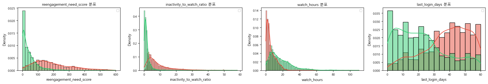
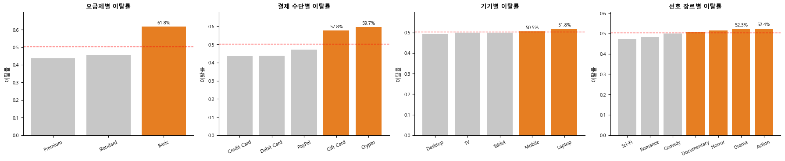
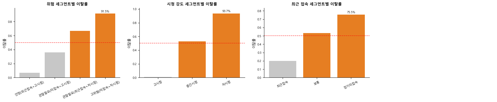

# Churn EDA Report

> This report focuses on exploratory data analysis (EDA) to identify key behavioral patterns associated with customer churn.

---

# 1. Target Distribution

### Observation

- Stayed: 2,485 (49.7%)
- Churned: 2,515 (50.3%)

### Interpretation

이탈 여부 분포는 거의 50:50으로 균형을 이루고 있다.  
이는 데이터가 **balanced dataset**임을 의미하며, 특정 클래스에 치우치지 않고  
패턴 기반 학습이 가능한 구조이다.

### Insight

- 모델 성능 평가 시 Accuracy 왜곡 없음
- churn 패턴 자체를 신뢰성 있게 분석 가능

---

# 2. Core Behavioral Features

## 2.1 Reengagement Need Score

### Observation

- Stayed: 0~100 구간 집중
- Churned: 100~300 이상 구간 분포

### Interpretation

두 그룹 간 분포가 명확히 분리되며, 값이 증가할수록 churn 비율이 증가한다.

### Insight

- churn risk를 직접적으로 반영하는 핵심 feature
- threshold 기반 segmentation 가능

---

## 2.2 Inactivity Ratio

### Observation

- Stayed: 0~3 구간
- Churned: 5 이상 구간 증가

### Interpretation

비활동 시간이 증가할수록 churn 확률이 급격히 증가하는 구조이다.

### Insight

- engagement보다 inactivity가 더 강력한 signal

---

## 2.3 Watch Hours

### Observation

- Stayed: 10~30 구간
- Churned: 0~10 구간

### Interpretation

사용량이 낮은 사용자일수록 churn 비율이 높다.

### Insight

- engagement-driven retention 구조

---

## 2.4 Last Login Days

### Observation

- Stayed: 0~20일
- Churned: 30~60일

### Interpretation

최근 접속하지 않은 기간이 길수록 churn 발생 가능성이 커진다.

### Insight

- churn은 시간 기반 프로세스

---

# 3. Derived Features

## 3.1 Watch Hours per Profile

### Insight

- 파생 변수 분포 그래프에서 계정 활용도 관련 변수는 전반적으로 낮은 값에 집중되어 있다.
- 특히 profile당 시청시간이 낮은 구간에서 churn 가능성이 높아지는 패턴을 확인할 수 있다.

---

## 3.2 Avg Watch Time

### Insight

- 대부분 사용자는 낮은 평균 시청시간 구간에 몰려 있으며, 일부 heavy user가 long-tail 형태로 존재한다.
- 이는 사용자 행동이 **light user vs heavy user** 구조로 양극화되어 있음을 의미한다.

---

## 3.3 Number of Profiles

### Insight

- 프로필 수 자체는 큰 폭의 차이를 보이지 않지만, 다중 프로필 사용자는 상대적으로 churn 가능성이 낮은 경향이 있다.
- 이는 shared account 기반의 **lock-in effect**로 해석할 수 있다.

---

# 4. Boxplot Analysis

### Observation

- Churn 그룹:
  - inactivity ↑
  - watch_hours ↓
  - reengagement_score ↑
  - profile당 시청시간 ↓
  - 평균 시청시간 ↓

### Interpretation

박스플롯 기준으로 churn 그룹은 주요 행동 변수에서 일관되게 불리한 방향을 보인다.  
즉, 이탈은 단일 변수 문제가 아니라  
**복합적인 행동 패턴 결과**로 해석할 수 있다.

---

# 5. Categorical Analysis

## Subscription
- Basic: 61.8% churn
- Premium / Standard 대비 높은 이탈률
- low commitment user 비율이 높은 것으로 해석 가능

## Payment
- 비정기 결제 수단에서 churn 증가
- auto-payment 유도 전략 필요

## Device
- 특정 디바이스에서 churn 증가
- UX 또는 사용 환경 차이 가능성 존재

## Genre
- 콘텐츠 선호 장르에 따라 churn 차이 존재
- 콘텐츠 만족도 및 추천 정교화 필요

---

# 6. Segment Analysis

### Observation

- High-risk: 91.5% churn
- Mid-risk: 약 65%
- Low-risk: 10% 미만

### Interpretation

고객군별로 churn 패턴이 매우 명확하게 분리된다.  
즉, 전체 고객을 동일하게 보기보다  
**segment-based churn management**가 필요하다.

### Insight

- 고위험군은 즉시 개입 대상
- 중간군은 리텐션 캠페인 대상
- 저위험군은 유지 전략 중심 관리 가능

---

# 7. Correlation Analysis

### Insight

- last_login_days ↔ churn: positive correlation
- inactivity_ratio ↔ churn: positive correlation
- watch_hours ↔ churn: negative correlation
- reengagement score 관련 변수들도 churn과 높은 연관성 존재

### Interpretation

상관관계 히트맵 기준으로 churn은  
**비활동성 증가**와 **사용량 감소**에 밀접하게 연결되어 있다.  
특히 inactivity, recency, engagement 계열 feature들이 핵심 축을 형성한다.

---

# 8. Final Conclusion

### Key Pattern

Churn users consistently show:

- 낮은 사용량
- 높은 비활동성
- 긴 미접속 기간
- 낮은 요금제
- 비정기 결제
- 낮은 계정 활용도

---

### Final Statement

> Churn is not random.  
> It is a behavioral outcome driven by declining engagement.
