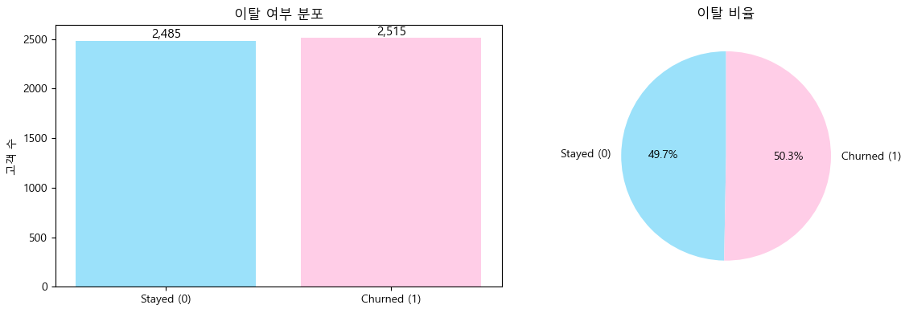
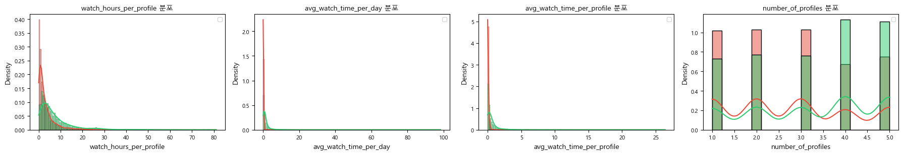
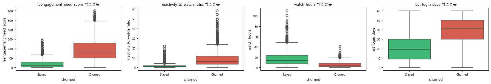
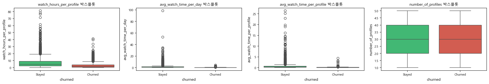
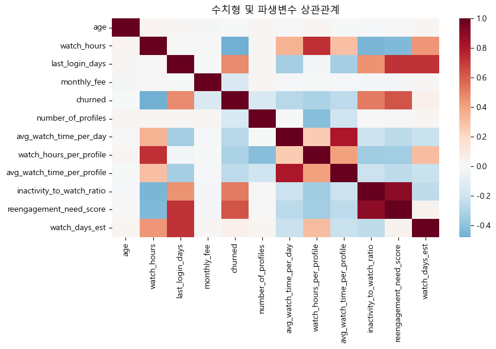

# 📊 Churn EDA Report

> This report focuses on exploratory data analysis (EDA) to identify key behavioral patterns associated with customer churn.

---

# 1. Target Distribution

### Observation

* Stayed: 2,485 (49.7%)
* Churned: 2,515 (50.3%)

### Interpretation

이탈 여부 분포는 거의 50:50으로 균형을 이루고 있다.
이는 데이터가 **balanced dataset**임을 의미하며, 특정 클래스에 치우치지 않고
패턴 기반 학습이 가능한 구조이다.

### Insight

* 모델 성능 평가 시 Accuracy 왜곡 없음
* churn 패턴 자체를 신뢰성 있게 분석 가능

---

# 2. Core Behavioral Features

## 2.1 Reengagement Need Score

### Observation

* Stayed: 0~100 구간 집중
* Churned: 100~300 이상 구간 분포

### Interpretation

두 그룹 간 분포가 명확히 분리되며, 값이 증가할수록 churn 비율이 증가한다.

### Insight

* churn risk를 직접적으로 반영하는 핵심 feature
* threshold 기반 segmentation 가능

---

## 2.2 Inactivity Ratio

### Observation

* Stayed: 0~3 구간
* Churned: 5 이상 구간 증가

### Interpretation

비활동 시간이 증가할수록 churn 확률이 급격히 증가하는 구조

### Insight

* engagement보다 inactivity가 더 강력한 signal

---

## 2.3 Watch Hours

### Observation

* Stayed: 10~30 구간
* Churned: 0~10 구간

### Interpretation

사용량이 낮은 사용자일수록 churn 비율이 높다

### Insight

* engagement-driven retention 구조

---

## 2.4 Last Login Days

### Observation

* Stayed: 0~20일
* Churned: 30~60일

### Interpretation

최근 접속하지 않은 기간이 길수록 churn 발생

### Insight

* churn은 시간 기반 프로세스

---

# 3. Derived Features

## 3.1 Watch Hours per Profile

### Insight

* 계정 활용도가 낮을수록 churn 증가

---

## 3.2 Avg Watch Time

### Insight

* 대부분 라이트 유저, 일부 헤비 유저 존재
* 사용자 행동 양극화

---

## 3.3 Number of Profiles

### Insight

* 프로필 수 많을수록 churn 감소 (lock-in effect)

---

# 4. Boxplot Analysis

### Observation

* Churn 그룹:

  * inactivity ↑
  * watch_hours ↓
  * reengagement_score ↑

### Interpretation

이탈은 단일 변수 문제가 아니라
**복합적인 행동 패턴 결과**

---

# 5. Categorical Analysis

## Subscription

* Basic: 61.8% churn
  → low commitment user

---

## Payment

* 비정기 결제에서 churn 증가
  → auto-payment 중요

---

## Device

* 특정 디바이스에서 churn 증가
  → UX 영향 가능

---

## Genre

* 콘텐츠 만족도 차이 존재

---

# 6. Segment Analysis

### Observation

* High-risk: 91.5% churn
* Mid-risk: ~65%
* Low-risk: <10%

### Interpretation

고객군별로 명확한 이탈 패턴 존재

---

# 7. Correlation Analysis

### Insight

* last_login_days ↔ churn (positive)
* watch_hours ↔ churn (negative)
* inactivity ↔ churn (positive)

---

# 8. Final Conclusion

### Key Pattern

Churn users consistently show:

* 낮은 사용량
* 높은 비활동성
* 긴 미접속 기간
* 낮은 요금제
* 비정기 결제

---

### Final Statement

> Churn is not random.
> It is a behavioral outcome driven by declining engagement.

---
